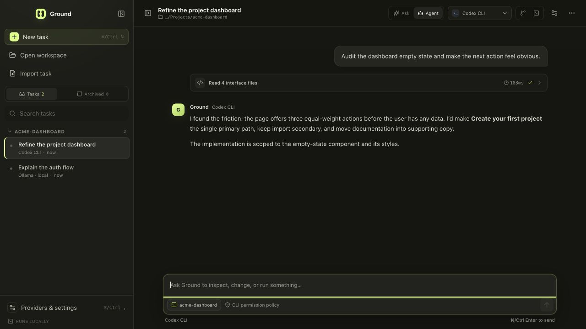

# Ground

**The open workspace for coding agents. Your ground. Any model.**

Ground is a local-first desktop workspace for coding with models and external agent
runtimes without making a hosted relay the center of your work. Ground keeps the
workspace, task history, provider profiles, and permission surface on your machine.
It connects directly to the endpoint or executable you choose.

> **Source project / unsigned previews:** Ground is an experimental open-source
> project for development and evaluation on non-sensitive repositories. The
> repository can build unsigned preview artifacts, but no official or supported
> binary has been published. Persisted and adapter contracts can still change.
> Unsigned previews are unnotarized on macOS, have no automatic updater, and require
> the platform caveats below.



## Project documents

Ground is designed so contributors and coding agents can continue the project
without private conversation history:

- [Product requirements](docs/PRD.md) define the durable user problems, product
  principles, requirements, acceptance criteria, and non-goals.
- [Build plan](docs/BUILD-PLAN.md) defines delivery order, workstreams, and
  milestone gates.
- [Roadmap](ROADMAP.md) records milestone outcomes and broad delivery status.
- [Agent guide](AGENTS.md) is the provider-neutral repository onboarding and
  source-of-truth index.
- [Contributing](CONTRIBUTING.md), [architecture](docs/ARCHITECTURE.md), and the
  [threat model](docs/THREAT-MODEL.md) define the engineering and security
  boundaries.

GitHub issues and milestones own live task status and assignment. The committed
documents explain why the product exists, how it must behave, and in what order
major work should proceed.

## What works today

| Connection | How it runs | Status |
| --- | --- | --- |
| OpenAI-compatible API | Direct HTTP(S), including Ollama and LM Studio | Integrated |
| Codex CLI | Local process with normalized JSON Lines events | Integrated |
| Claude Code | Local process with normalized streamed JSON events | Integrated |
| Gemini CLI | Local process with normalized streamed JSON events | Integrated |
| Antigravity CLI 1.1.8+ | Local process with normalized streamed JSON events | Integrated |
| Generic CLI | Local process that accepts a prompt and emits text or JSON Lines | Integrated, limited |
| OpenAI Responses | Direct HTTPS through the provider-neutral model loop | Integrated |
| Anthropic Messages | Direct HTTPS through the provider-neutral model loop | Integrated |
| Google Gemini API | Direct HTTPS through the provider-neutral model loop | Integrated |

The first-class hosted adapters have mocked protocol and end-to-end application
tests. CI does not hold provider credentials or make paid live-provider requests, so
they are integrated but not yet version-certified against live cloud services.
A separate credential-free loopback SSE test sends a real
`POST /v1/chat/completions` through the production OpenAI-compatible adapter and
verifies system/user messages, tools, streamed text, and normalized completion. It
does not contact or certify OpenAI, Ollama, LM Studio, or another real deployment.

“Any model” means a model can connect through a supported direct API protocol, an
OpenAI-compatible endpoint, or a compatible CLI adapter. It does not mean every
provider-specific feature is automatically portable. Ground exposes capabilities
explicitly and keeps a normalized history so switching providers does not make the
task unreadable.

Built-in model protocols and agent CLIs are selected through one static,
source-trusted adapter registry. Downstream builds can register another reviewed
adapter without replacing Ground’s canonical reducers or managed tool loop, but
Ground does not load arbitrary provider plugins at runtime. A new first-class
provider form or profile kind still requires a reviewed source change and rebuild. See
[docs/PROVIDER-SDK.md](docs/PROVIDER-SDK.md). The same canonical contracts compile
into a versioned, provider-neutral adapter SDK package with a deterministic
conformance runner; npm publication remains a separate maintainer release step.

## Current experience

- Persistent local workspaces, tasks, provider profiles, and run timelines
- Streaming assistant output and normalized runtime activity
- Ask mode with bounded read-only workspace tools, and Agent mode with the full
  Ground-managed tool set
- Reviewable Ask-to-Agent handoff that switches the task mode and prepares an
  editable task-local draft without starting a run
- Provider switching with per-item provider attribution and normalized tool-call
  and tool-result context
- First-run provider setup split into Hosted API, Local server, and Installed CLI
  paths, with passive local CLI detection presented as a path match rather than a
  health or authentication claim
- Approval-gated full writes, exact localized edits, commands, and MCP calls for
  Ground-managed API agents, with an exact native allow-once confirmation
- Durable start/completion claims for Ground-managed writes, commands, and MCP
  calls; an interrupted claim is reported as outcome unknown and is never
  automatically retried
- Sensitive-path filtering and workspace-relative model-visible paths
- Portable JSON task bundles, Markdown transcript export, and confirmed task
  deletion
- Safe task forks, reversible archive/restore, and bounded, keyboard-complete
  search across active or archived task history
- Interactive, multi-session task terminals backed by a real local PTY
- Git branch/status, structured per-file staged and unstaged diff review with
  keyboard hunk navigation, a bounded reviewed-hunk-to-editable-prompt action,
  and an exact raw-patch fallback, path staging/unstaging, exact-tree commits
  bound to the exact approved checked-out local branch, bounded history,
  recoverable selected-file restore/undo, and managed-worktree create/remove
- Remote Streamable HTTP and local stdio MCP servers with namespaced tools,
  launch and definition trust, and per-call approval
- Native session-resume support for recognized Codex, Claude, Gemini, and
  Antigravity CLIs
- Provider-neutral runtime event validation with split-delta credential
  redaction, opaque activity identities, abort-safe projection, and
  compatibility-bound session persistence
- Run cancellation, command timeouts, and process-group termination
- Per-task unsent composer drafts while Ground is open, including draft-only
  preparation during a run or approval wait, plus a keyboard command palette for
  common workspace and provider actions
- Near-bottom-only streaming follow with a task-bound **Jump to latest** action
  that preserves reading position until the user deliberately resumes following
- Source-bound **Copy response** and fenced-block **Copy code** actions on stable
  assistant output. The main process re-resolves the exact retained source before
  a user-activated plain-text clipboard write; copying never starts a run,
  contacts a provider, or mutates a draft
- Reviewable failed-run recovery that copies the exact retained request into an
  empty editable task-local draft without automatically retrying or replacing
  newer text
- A bounded, atomic local state document plus three rotating last-known-good
  snapshots, corruption quarantine, an in-app recovery browser, credential-free
  export, and native-confirmed retained-snapshot restore that drains and seals
  renderer operations through relaunch
- A strict private credential vault backed by OS secure storage when it is
  genuinely available, with quarantine and visible re-entry guidance when saved
  credentials become unreadable

## Run Ground

Ground supports Node.js 22.12 or newer. The reproducible CI and release toolchain
uses Node.js 24.18.0 (from `.nvmrc`) and npm 11.16.0. Install that npm version
with your toolchain manager before running project commands; use
`npm run toolchain:check` when reproducing CI or a release.

From a source checkout:

```bash
npm ci
npm run dev
```

`npm ci` enforces the reviewed, version-pinned dependency install-script policy in
`package.json`; an unreviewed install script fails the install. Ground’s own
postinstall invokes the exact locked Electron runtime installer because Electron 43
downloads lazily, then verifies the embedded runtime version and Electron/Chromium
license inventory before development or packaging can continue.

Useful workspace shortcuts:

| Action | Shortcut |
| --- | --- |
| Open the command palette | `Ctrl/⌘ + Shift + P` or `F1` |
| Search tasks | `Ctrl/⌘ + K` |
| Create a task | `Ctrl/⌘ + N` |
| Open provider settings | `Ctrl/⌘ + ,` |
| Toggle the task terminal | `Ctrl/⌘ + \`` |
| Send a prompt | `Ctrl/⌘ + Enter` |

The command palette is keyboard navigable, traps focus while open, restores prior
focus, and ignores execution keys during input-method composition. Streaming text
uses a separate batched polite announcement instead of repeatedly announcing the
whole message, and the timeline follows new output only while the reader remains
near the bottom. Scrolling away exposes **Jump to latest** without moving the
viewport. Follow remains paused through later messages and responsive layout
changes until keyboard or pointer activation returns to the exact current bottom,
resumes following, and announces the change. The control and announcement state
reset when the selected task changes. Stable assistant messages expose **Copy
response**, and each represented fenced code block exposes **Copy code**. The
preload requires active user activation and sends only a bounded source identity;
the main process re-resolves the exact task, message, content, and code-node
offsets before writing plain text. The renderer receives only success or failure,
ignores late results from stale tasks or content, and announces repeatable visible
and polite status without moving focus. The bridge has no clipboard-read, rich
HTML, or arbitrary-text operation. Unsent composer text is kept separately for
each task for the current app process; it is not written to durable task state.
While a task is running or waiting for approval, its textarea remains editable so
the next prompt can be prepared. That text is not queued, sent, or used to steer
the active run; the Stop control remains the only run action and `Ctrl/⌘ + Enter`
is inert until the run finishes. When the latest retained run ends with **Run
failed**, **Prepare retry** can copy only that run's exact non-imported user
message into an
empty task-local draft. Existing draft bytes are preserved, outcome-unknown **Run
interrupted** recovery is excluded, and no provider or runtime is contacted until
the user reviews and explicitly sends the draft. Responsive layouts, forced-color
styles, reduced motion, and focus-visible states are implemented, but the project
does not yet claim a complete cross-platform accessibility audit.

`Ctrl/⌘ + K` opens the sidebar when necessary and focuses the search field for the
current active or archived scope. In that field, Enter opens the first current
result, Arrow Down and Arrow Up focus the first and last current results, and
Escape clears a nonempty query before a second Escape leaves search. Activation
clears the query and selects the exact current result by its opaque task ID.
Input-method composition, modified key combinations, and an empty result set are
left alone. After activation, narrow-layout close and returned focus run only
while the originating selection request and task remain current.

## Connect a model

Open **Providers & settings** in the desktop app.

New provider setup begins with three explicit connection paths:

- **Hosted API** connects Ground directly to a cloud endpoint using the selected
  protocol and account credential.
- **Local server** fills a loopback OpenAI-compatible template for Ollama, LM
  Studio, or another server that the user already operates.
- **Installed CLI** configures an existing coding-agent executable. Ground may
  offer passively detected local candidates, but detection does not prove sign-in,
  model access, or a successful turn.

### First-class hosted API

Choose OpenAI, Anthropic, or Google AI, then enter the model identifier and API key
for your account. Ground uses the provider’s direct protocol—OpenAI Responses,
Anthropic Messages, or Google Gemini—rather than translating all three through a
Ground-hosted gateway.

The default provider endpoint is shown and can be reviewed before saving. Changing
the provider kind or canonical endpoint invalidates the saved credential and
requires the key again. Saving any provider creates an **unverified** revision.
Ground will not start a task with that provider until **Test** passes for the exact
saved revision; changing and saving it requires another test. First-class API tests
use each provider’s model-discovery authentication and response shape. A CLI test
validates the saved executable configuration without claiming a live model run.
Failed checks retain only a bounded failure category while keeping the immediate,
redacted diagnostic available in the settings view. Ground gives corrective
guidance for refused connections, DNS, TLS, authentication, rate limits, timeouts,
incompatible response shapes, missing executables, and CLI startup failures. The
same safe categories can appear on failed run activities; unknown failures stay
generic instead of being guessed from error prose.
API-key and CLI-environment replacements are staged under new opaque versioned
vault references before the profile points to them, so a failed state write cannot
overwrite the secret used by the previously verified profile. Run startup reserves
the exact task, provider revision, configuration fingerprint, and credential
boundary before any CLI authorization or workspace lookup; provider edits are
refused until that start has either committed or failed.

Secret replacement is coordinated by the main-only `pendingSecretDeletes` journal
inside the same state document as the provider pointer. Ground first journals the
new reference as provisional, stages its encrypted value, atomically publishes the
new provider plus the exact obsolete references, deletes only those journaled
references, and acknowledges them in state after the vault delete succeeds. Clear
and provider-delete operations start at the atomic publish step. Ground never
enumerates the vault and deletes the complement of current provider state.

Profiles saved before API credential revisions existed may read their unchanged
provider-ID legacy key only when the exact boundary-scoped record is absent. That
fallback is read-only during Test and run startup; it does not migrate or delete the
legacy value. An explicit same-boundary save stages a versioned replacement.
Profiles with a credential revision, and profiles marked as having no key, never use
the provider-ID fallback.

### OpenAI-compatible endpoint

Enter:

- a base URL such as `http://127.0.0.1:11434/v1` for Ollama or
  `http://127.0.0.1:1234/v1` for LM Studio;
- the model identifier expected by that endpoint; and
- an API key if the endpoint requires one.

The included local values are a connection template only. Ground does not supply,
install, or start Ollama, LM Studio, or another local runtime, and it does not pull
or download models. Start the server separately and load the exact model identifier
before testing it in Ground.

Non-loopback endpoints must use HTTPS. Ground sends requests directly to the
configured origin and rejects redirects. It does not route model traffic through a
Ground service. **Test connection** first requests the compatible endpoint’s
`/models` route. Some valid servers omit or restrict that route, so if discovery
cannot prove success Ground makes a separate bounded, non-streaming
`/chat/completions` request to the exact configured model (`max_tokens: 4`). The
test succeeds only if either response has the expected shape; it rejects redirects,
bounds both responses, and combines redacted diagnostics if both probes fail. That
fallback is a real generation request and can consume a small amount of the
configured endpoint’s quota.

When main confirms that a literal-loopback connection was refused, the provider
form shows a local-server checklist and offers any passively detected CLI
alternatives. Ground does not infer that diagnosis from arbitrary error text, so
authentication, protocol-shape, and other failures retain their original
diagnostics instead of being presented as a stopped server.

In Agent mode, the integrated API path can expose `list_files`, `read_file`,
`search_files`, `write_file`, `edit_file`, and `run_command`. Reads are bounded and
sensitive paths are filtered. `edit_file` requires an exact source match and is
unique by default; every full write, localized edit, and command pauses for an
inline approval. Tool authority remains in Ground’s main process, not in the
renderer or provider.

`run_command` approval binds the canonical workspace and working directory,
content-hashed launch files, exact spawned argv, and timeout. On Windows it uses the
same reviewed Node-shim path described below, which supports common commands such
as `npm test` without interpolating model-provided arguments into `cmd.exe`.
The invoked program can still apply its own command or shell semantics.

Ask mode can expose only `list_files`, `read_file`, and `search_files`. MCP tools,
writes, and commands are not advertised in Ask mode. The provider’s advanced
settings can override the context-window estimate and maximum response tokens, and
can opt into low, medium, or high reasoning effort. These values are best-effort
provider inputs: an incompatible endpoint or model may reject them.

For managed API runs, Ground reserves the latest user message as the active
objective before it fills the remaining request budget with recent complete
conversation and tool-result groups. If an exact but dominant objective would
displace all newer evidence, Ground keeps a visibly marked, bounded head-and-tail
form so both can fit; it never splits a complete tool group. A budget too small
even for the marked objective fails before provider egress. The single **Context
window managed** timeline activity updates when later rounds require a different
reduction, while the full task history remains local.

After a completed, non-imported Ask response, an idle task with a workspace and an
Agent-capable provider offers **Continue in Agent**. The action is bound to that
exact task, provider, and assistant response. It persists Agent mode, then prepares
an editable task-local draft and focuses the composer; it preserves any draft the
user already wrote. The response remains context, not execution authority: Ground
does not start a run, carry an approval forward, or contact the provider until the
user explicitly sends the draft. Provider sessions are mode-bound, so an
Ask/read-only session is not silently resumed with Agent authority.

### CLI agent

Ground detects Codex CLI, Claude Code, Gemini CLI, and Antigravity CLI passively in
a bounded set of conventional system and user tool-manager locations, including
common Volta, pnpm, Bun, asdf, and NVM paths. It does not recursively scan
directories or launch a detected candidate, and it rejects candidates controlled
by a configured Ground workspace. **Choose executable…** opens a main-process-owned
native file picker and validates the selected direct executable or reviewed Windows
Node package shim without running it. Saving the profile and launching the final
invocation remain separate native confirmations.
Candidates shown in onboarding are therefore described as detected locally, not
healthy or authenticated.

The Antigravity structured preset requires version 1.1.8 or newer. Ground runs its
bounded `--version` probe only after the user confirms the saved executable and
Ground revalidates it. A generic CLI profile supports:

- an executable name or absolute path;
- one argument per line;
- `{prompt}`, `{model}`, and `{cwd}` tokens;
- prompt delivery through stdin or an argument; and
- plain streamed output or JSON Lines; and
- optional encrypted profile-specific environment variables for enterprise and
  custom runtimes.

The public [Generic CLI bridge contract](docs/GENERIC-CLI.md) documents the exact
plain-text and JSON Lines shapes and includes a dependency-free executable example.
It is the shortest path for wrapping another local runtime, provider SDK, or
internal gateway without changing Ground.

For Antigravity, Ground maps Ask to `--mode plan`, Agent to
`--mode accept-edits`, resumes with an explicit conversation ID, and strips
`--dangerously-skip-permissions`. Antigravity headless mode cannot ask for command
approval, so command actions are soft-denied unless its settings pre-allow them.

Installed CLIs continue to use their native sign-in, keychain, and configuration
stores by default. A profile override stores only each variable name plus opaque
fingerprint and record revisions in Ground’s normal state; its values are held
together under the exact versioned reference in the OS-protected secret vault and
never enter a task or provider snapshot. Leave an existing value blank to retain
it. If the old record is unreadable, entering every value replaces it without
consulting the old ciphertext, and removing every row clears the override.
Versioned profiles never fall back to an older provider-ID record. Custom values
must contain at least four characters so echoed values can be redacted safely.
Ground rejects duplicate names, executable-search and loader controls, and
root/config/temp redirects such as `PATH`, `NODE_OPTIONS`, `LD_PRELOAD`, `HOME`,
`XDG_CONFIG_HOME`, and `TMPDIR`.

The CLI environment fingerprint and record revision are separate random 32-byte
hex values, not hashes of the secret values. The fingerprint is copied into the
encrypted envelope and provider metadata so Ground can reject a record that does
not belong to that profile. The independently generated record revision selects
the versioned vault reference. The complete saved-provider and continuation
fingerprint includes both. Native configuration and per-run invocation
authorization bind the variable names plus environment fingerprint; the record
revision is only the exact vault selector. Neither identifier reveals the values.

Ground first asks for native confirmation of the saved executable and argument
template. Immediately before a run, it separately authorizes the fully expanded
argv, canonical workspace, source-registered runtime adapter ID, CLI dialect,
parser, prompt transport, environment-key set, opaque environment fingerprint, and
content-hashed launch identity. Names and the non-secret fingerprint appear in the
native dialog; values and the vault record revision do not. Changing a name or
value invalidates the prior
configuration and invocation grants. Argument prompts
are redacted in the dialog but remain bound into that authorization. Stdin prompt
content is treated as process data: it is neither shown nor hashed into the launch
grant, so an otherwise identical stdin-based runtime does not prompt again for
every turn. Exact grants are memory-only and expire when Ground exits. Launch files
larger than 512 MB are rejected rather than approved without a complete hash.

On macOS and Linux, Ground spawns the resolved executable with an argv array rather
than constructing a shell command. On Windows it directly launches `.exe`/`.com`
programs. Standard npm-installed Node `.cmd`/`.bat` shims for commands such as
`codex`, `claude`, `gemini`, and `npm` are parsed as data; Ground binds the shim,
canonical package script, Node interpreter, and exact argv, then launches Node
without asking `cmd.exe` to interpret the arguments. Other batch files and
PowerShell launchers are rejected. A launched program can still start its own shell
(for example, npm does this for package scripts). Recognized runtimes are launched
with their supported read-only/planning policy in Ask mode and workspace-editing
policy in Agent mode.

An external CLI still runs as the current operating-system user. Ground can observe
its reported activity, but it cannot approve or deny the runtime’s internal actions.
The CLI’s own sandbox, permission policy, authentication, plugins, and telemetry
remain in effect.

### MCP tools

Open **Providers & settings → MCP servers** to add either:

- an unauthenticated remote Streamable HTTP endpoint; or
- a local stdio executable with one argument per line.

Remote endpoints require HTTPS except for literal loopback HTTP, and redirects are
rejected. Local servers are resolved to an absolute executable and launched with an
argv array, no shell, and a reduced environment. Before the first exact local
launch in an app session, a native dialog shows the executable identity, complete
argv, working directory, environment-key set, and invocation fingerprint. Ground
hashes regular executables up to 256 MiB, revalidates their identity around launch,
and binds the invocation identity into stdio tool fingerprints. Ground prefixes
discovered tools as `mcp__<server>__<tool>` so they cannot silently shadow built-in
tools.

Connecting does not make a tool available to models. Ground fingerprints each
tool’s title, description, and input schema. The user must approve the exact
discovered fingerprint set, and changed or newly added definitions are blocked
until reviewed again. Changing a server namespace, transport, URL, executable, or
arguments clears saved definition trust. Every individual MCP invocation then
pauses again to show the server, tool, definition fingerprint, and complete
arguments before execution. The prepared call also binds a connection fingerprint
covering the canonical remote URL and namespace, or the exact stdio invocation and
namespace. Ground verifies it after refresh and immediately before dispatch, so
reconfiguring the same server ID while approval is open cannot redirect the call.

At startup, Ground connects enabled remote servers concurrently and serializes
local stdio launches so native trust dialogs cannot overlap. A managed API run
waits for that startup attempt to finish before constructing its first tool set;
the first model request therefore cannot silently omit a still-initializing MCP
server. Each queued startup turn re-reads the current saved profile, and tool
listing and final dispatch require that exact profile to remain enabled,
unchanged, connected, and definition-trusted.

MCP shutdown is bounded rather than an unlimited wait: Ground closes new admission,
aborts pending connections and active client lifecycles, gives each client close or
pending connection up to 2 seconds to settle, and caps the manager-wide wait
(including queued operations) at 2.5 seconds. Local stdio termination separately
uses bounded TERM/KILL waits. These bounds keep quit and restore from hanging; they
do not prove that a non-cooperative transport or escaped descendant has stopped.

MCP is intentionally tool-only in this preview. Remote authentication headers and
OAuth, resources, prompts, MCP Apps/UI, and elicitation are not supported. A local
stdio server is native code running with the current operating-system user’s
permissions; launch trust, schema trust, and call approval are not an OS sandbox.
See [SECURITY.md](SECURITY.md) for the remaining executable-path, helper-script,
large-file, and best-effort descendant-cleanup limitations.

## Local recovery

Persisted application state is currently schema version 2. Ground migrates version
1 through an explicit one-step dispatcher and fails closed on newer or skipped
versions before the current schema is accepted. The primary state document and
three retained validated generations are separate from the credential vault.
Recovery settings show only bounded metadata behind short-lived opaque selections;
exports contain state history but never the vault. The main-owned restore prompt
shows the selected retained generation, capture time, task/provider counts, byte
size, and content-digest prefix. Restore requests are single-flight before that
prompt. After confirmation, Ground seals the renderer operation boundary, drains
operations that entered before it closed, revalidates the selected content-bound
generation, initiates MCP manager shutdown with its 2.5-second aggregate bound,
performs the replacement, and keeps the boundary sealed through relaunch—even when
a late persistence error is reported. That bound is best effort and does not prove
that an uncooperative external process terminated.

At startup, a structurally malformed credential vault is preserved under an
unreadable quarantine name and Ground shows a re-entry warning for affected
providers. The same warning is derived again on later starts when provider metadata
expects a credential or CLI environment envelope that can no longer be decrypted.
A temporary OS keychain outage does not cause otherwise valid ciphertext to be
quarantined; runs remain blocked until secure storage is available or the affected
value is re-entered.

The credential vault caps each UTF-8 plaintext at 768 KiB and each encrypted binary
value at 1 MiB, then requires canonical base64 whose decoded size stays within that
binary limit. Its steady-state limit is 1,000 records and 8 MiB of serialized JSON;
staging may temporarily use at most 2,000 records and 16 MiB. The projected map
after explicitly obsolete references are removed must normally fit the steady bound;
when recovering an already-transitional vault, Ground permits only a strict
non-growing improvement toward that bound.

On startup Ground drains only exact references present in
`pendingSecretDeletes`. A live-reference guard retires a stale delete intent rather
than deleting a value still selected by the loaded provider state. If startup had
to select an older state generation or reset state, Ground defers the entire
cleanup journal for that process, deletes no queued ciphertext, shows a recovery
notice, and retries after review on a later launch. If an atomic state or vault
publication reports an error after rename may already have succeeded, startup
aborts before writable services are exposed. The same ambiguity during an
already-running state publication—or a provider-vault mutation—seals every later
state mutation and new renderer change, then relaunches. The journal in whichever
disk generation won resolves either the provisional or obsolete exact references.

`pendingSecretDeletes` is excluded from ordinary renderer snapshots. A raw local
state-snapshot export can include its opaque reference strings because it exports
the selected state generation, but it never includes the separate encrypted vault
or plaintext values.

## Task portability

The task menu can export either:

- a versioned, strictly validated JSON bundle containing a portable provider
  descriptor, timeline, and portable canonical conversation; or
- a readable Markdown transcript.

The descriptor has an exact, intentionally narrow meaning. For an API profile it
contains only `type: "model-api"`, protocol `kind`, sanitized `name`, `model`, and
`supportsTools`. For a CLI profile it contains only `type: "agent-cli"`,
`kind: "cli"`, sanitized `name`, `model`, and `adapter`. It omits local provider
IDs, endpoints, credentials and key flags, executable/arguments/environment,
verification, and continuation state.

The exporter omits provider credentials, native runtime sessions, workspace
authority, provider-owned continuation state, and original internal IDs. It
rekeys tool calls, removes secret-shaped JSON fields, and replaces the selected
workspace’s absolute path with `<workspace>`. It cannot recognize arbitrary secrets
that a user pasted into prose or tool output, so inspect every exported file before
sharing it.

Imported bundles are size- and structure-bounded, receive new local identities, and
do not receive a workspace grant, runtime session, pending approval, or execution
authority. Imported timeline entries remain visibly marked and excluded from model
context by default. The task banner can explicitly include or re-exclude them;
enabling the control requires a native warning. An import match means equality on
the portable descriptor field set—not equality of an endpoint or credential
identity, because those fields are absent. For an API descriptor, `kind`, `name`,
`model`, and `supportsTools` must match; for a CLI descriptor, `name`, `model`, and
the normalized adapter must match. Ground selects that portable match when present,
otherwise the currently selected task’s provider or the first configured provider.
Only an exact API descriptor can retain the bundle’s canonical conversation as an
imported seed. It may reach a later request only after the imported-history opt-in
and a user-started run, so verify the locally selected endpoint before enabling it.
Imported content must therefore be treated as untrusted.

Task forks are explicit local working copies. Ground assigns new task, item, run,
and tool-call identities; drops pending approvals, CLI sessions, checkpoints,
provider-owned state, and incomplete tool exchanges; and preserves the source
task’s readable canonical history and workspace selection. Archiving is reversible
and disables new Ground run/workspace actions until restored. An already running
PTY is detached rather than killed and may continue at the OS level. Sidebar search
is local, bounded, and can be scoped to active or archived tasks. Keyboard
activation uses the displayed current filtered order and delegates the selected
opaque task ID to the same selection path as a pointer activation; it does not
cache an earlier result identity.

## Workspace terminal and Git

Each task with an authorized workspace can open a real interactive PTY in the
Terminal panel. Before each new shell starts, a native dialog shows its exact
executable, arguments, and canonical working directory. Ground streams the shell
through xterm.js, bounds in-memory scrollback and input, and supports multiple
sessions, switching, resize, reattach, restart, and termination. Hiding or
switching the panel detaches its opaque renderer attachment without killing the
process; stale attachments cannot type or resize. Terminal sessions and scrollback
are process-local and end when Ground quits.

The Git panel reads branch/ahead/behind state, staged, unstaged, untracked, and
conflicted paths, staged and unstaged unified diffs, bounded commit history, and
registered worktrees. Diff review is organized by file, preserves old and new line
numbers, summarizes additions and deletions, and supports keyboard file and hunk
navigation. Unsupported, binary, malformed, or safety-bounded patch segments fail
closed to their raw text; the complete captured patch is always available through
the raw view. Hostile presentation controls are shown there as visible Unicode
escapes, with an explicit copy-exact action for the underlying captured text.
Large structured patches are disclosed incrementally instead of mounting every
line at once.

If the panel is open when the selected task's run completes, stops, or fails,
Ground reads the repository once more without blanking the last successful
overview. An exact file and hunk selection survives when that review identity
still exists; removed or identity-changed targets fall back to a valid current
selection. Late or superseded reads remain bound to the task and request that
started them. If the refresh fails, the last overview remains visible with an
inline error and explicit **Retry** action.

For a complete structured hunk, **Add hunk to prompt** appends only that active
hunk to the exact task's process-local editable draft. The block records staged
or working-tree provenance, the parsed path reported by Git, and visibly escaped
captured lines under an explicit whole-block
untrusted-and-potentially-stale-workspace-text label. The complete block must fit
32,000 characters and is never sliced. This action does not send a message,
contact a provider, approve an operation, or change Git; the user can edit the
draft and must press **Send** separately.

The panel can stage or unstage selected paths, commit the exact prepared index
tree, create a branch in a dedicated managed worktree and open it as a new task,
remove a clean worktree registered inside that managed root, and restore selected
unstaged tracked files or untracked files through a recoverable workflow. Ground
requires Git 2.23 or newer.

Git discovery passively fingerprints fixed conventional paths and absolute entries
from Ground’s launch PATH, excluding any path controlled by a configured workspace.
If no trusted candidate is available—or the user wants another installation—the
panel’s **Executable** control opens a native picker. Ground first validates the
direct executable without running it, then shows its canonical path, SHA-256, size,
and identity fingerprint in a default-cancel native dialog. Only after approval
does it run the bounded `git --version` probe. The saved path/fingerprint is a
private preference, not permanent authority: Ground recreates and revalidates the
exact process-local binding before every later Git launch and stops if it changes.

Every Git mutation receives a native confirmation. Commits bind the staged-tree
object, expected parent, repository/worktree identities, and exact checked-out
local branch, then advance only that branch through a non-dereferencing
compare-and-swap. Detached-HEAD commits are refused. Concurrent index and
working-tree edits are preserved, and hooks/signing are disabled. Removing a
worktree rechecks cleanliness, registration, and containment, closes linked
terminals, and keeps linked task history while detaching its removed workspace.

A file restore shows the complete bounded preview and action fingerprints in a
default-cancel native dialog. Before mutation, Ground copies tracked working-tree
contents and moves selected untracked files into a private recovery area under its
managed worktree root—not inside the repository. It restores tracked files to the
current index without changing staged content. A conservative undo is offered only
while every affected path still matches the post-restore state; later edits make
undo fail closed. An interrupted restore remains visible as **Recovery required**
instead of being reported as complete.

Git is invoked as a resolved executable with fixed argv, no shell, disabled hooks,
bounded output, and a reduced environment. For status, working-tree diffs, staging,
and worktree checkout/removal, Ground discovers effective repository
content-filter drivers and overrides every clean/smudge/process slot to a no-op on
the exact Git invocation.

Filter neutralization prevents a repository-defined filter command from executing,
but repositories that depend on Git LFS, encryption, or another required content
filter can show pointer/encrypted content, unexpected dirty state, or an unusable
managed checkout in Ground’s Git view. Use the repository’s normal trusted Git
workflow for those repositories.

The terminal and Git panel are direct user workspace features, not extra model
authority. A PTY shell still has the operating-system permissions of the Ground
process. Ground does not provide arbitrary Git reset, remote fetch/push, arbitrary
worktree deletion, or signed commits through the Git panel.

## Trust boundaries

Ground distinguishes two execution models:

1. A **model adapter** gives Ground model output. Ground owns context, tools,
   approvals, and the agent loop.
2. An **agent runtime adapter** launches an existing coding agent. That runtime owns
   its tools and permissions; Ground owns the workspace/task presentation and
   normalizes events.

The renderer receives a narrow typed API. Canonical workspace paths, secrets,
filesystem operations, network credentials, process creation, runtime/model
sessions, pending approval state, and prepared side-effect envelopes stay in
Electron’s main process. The renderer receives only a revocable process-scoped
workspace grant ID and a path-free label derived from the basename; duplicates
receive an ordinal suffix. It presents the exact approval card. A denial resolves
immediately, while an allow-once request opens a main-process-owned native dialog
bound to the same immutable action envelope before execution can continue. Before
the side effect, the main process durably records a unique operation ID plus
separate hashes of the prepared action and native approval. Those durable evidence
fields are stripped from renderer snapshots and live/replayed events. Ground
returns the result to the model only after durably recording the outcome.

Registered runtime output crosses a second main-process projection boundary after
canonical validation. Ground stream-redacts configured CLI environment values
even when they span assistant deltas, redacts activity and notice text, replaces
provider activity IDs with opaque local IDs, rejects protected runtime/session
identity, consumes resumable sessions as one-attempt leases, and checks
cancellation before terminal state can persist. Successful hosted/local API output
crosses the same kind of boundary: resolved credentials are stream-redacted from
text and notices, while credential-bearing tool arguments or provider continuation
state fail closed. Ground races iterator reads against Stop, so an adapter that
ignores its signal cannot strand the task. Adapter-side redaction remains required
because external runtime code owns its process and may have access beyond Ground’s
configured secret resolver.

Read [SECURITY.md](SECURITY.md) and
[docs/THREAT-MODEL.md](docs/THREAT-MODEL.md) before using Ground with important
source code.

## Architecture

```text
React renderer
  │ typed, validated IPC
Electron preload
  │
Electron main process
  ├─ local task/provider/MCP store
  ├─ OS-protected secret vault
  ├─ Ground-managed model loop and tool broker
  ├─ static model + agent-runtime registry and factories
  ├─ MCP connection, definition-trust, and call broker
  ├─ workspace PTY service
  ├─ bounded Git and managed-worktree service
  ├─ direct model-protocol adapters
  └─ argv-based external runtime adapters
```

There is no required Ground account, cloud control plane, or provider relay.
See [docs/ARCHITECTURE.md](docs/ARCHITECTURE.md) for the ownership model and
[docs/PROVIDER-SDK.md](docs/PROVIDER-SDK.md) for the versioned adapter contracts
and conformance suite.

## Verify a change

```bash
npm run verify
npm run test:e2e:renderer
npm run smoke:clipboard:native
npm audit --audit-level=high
```

`verify` checks the reviewed build-dependency bridge, both TypeScript targets, the
test suite, pinned compatibility-fixture drift, the clean-room adapter SDK package,
the generated production-license inventory, and the production build. The separate
audit covers the complete locked tree, including Electron and packaging
dependencies.

`test:e2e:renderer` launches the real built React renderer in Electron with the
explicit browser-preview desktop mock and drives it through Playwright. It covers
command-palette focus/navigation, keyboard-complete task search and narrow-sidebar
focus, native HTML provider-form validation, task-local, active-run, and
failed-run draft preparation, Ask-to-Agent and reviewed-hunk draft handoffs,
paused-streaming reading-position recovery, source-bound assistant-response and
fenced-code clipboard copy, structured Git diff navigation and finished-run
refresh, mock send/cancel, archive/search, responsive settings, reduced-motion
and forced-color styles, plus the
local-template/refused-connection recovery path into a detected CLI. The current
suite contains 19 scenarios. CI runs it on macOS, Windows, and Linux/Xvfb. It does
not load the production preload/main process, invoke native permissions, use a
real provider, or replace screen-reader/manual accessibility testing. Separate
main-service and preload tests cover canonical source re-resolution, strict
request bounds, write failure, and user-activation gating at the production
bridge boundary.

`smoke:clipboard:native` builds Ground, launches the compiled production main
and sandboxed preload with an isolated deterministic task, and drives the native
assistant clipboard boundary through Electron. It verifies deny-all renderer
permissions, inactive user-activation refusal with no clipboard change, and exact
pointer- and keyboard-activated response/code writes through trusted IPC and
Electron's main-process clipboard. The smoke requires no provider credentials,
refuses to mutate clipboard formats it cannot restore, restores prior common
text/HTML/RTF/bookmark/image content on exit, checks ownership before each
planned mutation, and refuses restoration over detected newer content. Because
the OS clipboard has no atomic lease, do not use it during this short smoke.
Cleanup failure fails the smoke. This is source-build production-boundary
evidence rather than installer or screen-reader certification.

The suite covers provider event normalization and output bounds, CLI argv/event
parsing and cancellation, native session metadata, renderer/IPC trust checks,
provider readiness, credential recovery, task portability and lifecycle, state
migration and rotating-snapshot recovery, workspace containment, sensitive-path
filtering, full writes and localized edits, command envelopes and executable
identity, portable Windows PATHEXT/Node-shim handling and metacharacter-safe argv,
MCP startup ordering/launch identity/definition drift/call approval, PTY
authorization/attachments/scrollback, and Git filter neutralization,
staging/commits/recoverable restore/worktree containment/removal.

Compatibility and application tests use deterministic local fixtures, mocked
transports/processes, token-bound loopback provider servers, a smoke-owned
Codex-dialect child, and fixed native package probes. They do not make paid
live-provider requests, contact a real cloud/Ollama/LM Studio deployment, or
certify an installed and authenticated Codex, Claude, Gemini, Antigravity, or
Generic CLI.

## Package a preview

```bash
npm run dist:mac:unsigned
npm run dist:win:unsigned
npm run dist:linux
# Then smoke-test the matching packaged and distributable runtime:
npm run smoke:package:launch
npm run smoke:package:native
npm run smoke:package:distributable
```

Outputs are written beneath `release/`. The manual **Package previews** workflow
also targets macOS, Windows, and Linux on native hosted runners. These packages are
unsigned-preview workflow artifacts, not published, supported, or certified
distributions.
`dist:mac:unsigned` clears signing/notarization credentials and disables signing
identity auto-discovery for both the source build and packaging step, so a local
macOS preview cannot silently become a release artifact.
On Linux, AppImage extraction does not preserve the Chromium helper's root/setuid
metadata. Run the distributable smoke on a trusted package-test host with
`GROUND_PACKAGE_SMOKE_PREPARE_SANDBOX=sudo`; Ground elevates only the regular,
hash-matched temporary helper and verifies root ownership plus mode `4755` before
launch. The smoke never falls back to `--no-sandbox`.

The package workflows target macOS arm64, macOS x64, Windows x64, and Linux x64 on
matching native runners. They launch the unpacked app with an isolated temporary
profile and verify real main/preload/document startup without browser automation.
A bounded native smoke verifies packaged app identity, performs an OS-encrypted
credential-vault set/reload/get/delete round trip, opens and automatically cancels
a real native approval dialog, and exercises PTY, Git, the M1.1 provider/runtime
matrix, an exact local stdio MCP launch/call, and process-tree cleanup.

The provider/runtime matrix crosses the packaged main process, production static
registry, `ProviderService`, `RunManager`, and durable state. It independently
requires:

- a credential-free literal-loopback OpenAI-compatible readiness check and
  streamed first turn;
- a first-class OpenAI Responses readiness check and streamed first turn using a
  synthetic versioned credential, exact Bearer authorization, and `store: false`;
- a closed literal-loopback endpoint classified as `connection-refused`, with
  persisted failed readiness and dispatch blocked before a run event;
- malformed compatible discovery and generation responses classified as
  `protocol-shape`, with that bounded kind persisted in failed readiness and
  dispatch blocked before a run event; and
- a recognized Codex-dialect CLI turn through a token-bound Node child, including
  exact configuration/invocation trust envelopes, native session, command
  lifecycle, usage, and one non-fatal warning that must remain successful.

The CLI child is created by the smoke in its private token directory, and its
interpreter hash must match the Node executable running the outer smoke harness.
The unattended fixture replaces the two positive human CLI dialog decisions with
an exact smoke-only authority; it does not exercise passive detection or prove
human acceptance or race-free script-argument binding against another same-user
process. It also does not prove cleanup of a hung or hostile external CLI after
abnormal application exit. None of these fixtures certify live credentials,
internet/DNS/TLS behavior, an installed vendor CLI, a vendor sandbox, external
tools, Ollama, LM Studio, or another vendor service.

The distributable smoke extracts the macOS ZIP, silently installs the Windows NSIS
package in a temporary directory and verifies the executable and installation
directory are removed afterward, or extracts the Linux AppImage, then runs that
same native smoke against the resulting app. It emits one content-bound
runtime-evidence record for the exact distributable and architecture.
The release aggregator requires all four records and verifies their artifact
SHA-256 identities. DMG and DEB installation are not exercised by this harness.
This is bounded runtime evidence—not general installer, renderer interaction,
accessibility, live-provider/CLI, signing, notarization, or distribution
certification.

For the current source, a local macOS arm64 `npm run package:mac` build and
`npm run smoke:package:native` against its unpacked app passed, including the
complete deterministic M1.1 provider/runtime matrix described above. A
current-source distributable smoke and four-target aggregate have not been run.
The older
[four-target Package previews run](https://github.com/AlphaBetSoup789/ground/actions/runs/30473714099)
completed the required macOS arm64, macOS x64, Windows x64, and Linux x64 jobs for
source commit `a3073a8`, but it predates the expanded provider/runtime matrix.
Those artifact-bound records remain evidence only for that earlier smoke contract
and do not satisfy the current aggregate or certify later source or a supported
distribution.

Linux credentials require a working Secret Service/libsecret backend and an
unlocked desktop keyring. Ground refuses Electron’s insecure `basic_text` fallback.
The hosted smoke starts an ephemeral D-Bus session and GNOME keyring; on another
Linux environment, install a Secret Service implementation and `libsecret`, start
Ground inside that session, and unlock the keyring before saving or testing
credentials.

The tag-driven release workflow is scaffolded to require macOS signing/notarization
credentials, build native-platform artifacts, record each target build’s unpacked
`app.asar` inventory alongside exact distributable hashes in a runtime-inclusive
CycloneDX SBOM, create build/SBOM attestations, and open a draft prerelease. No
official artifact has been published or certified. Read
[docs/RELEASING.md](docs/RELEASING.md).

## Known limitations

- Hosted adapters have mocked transport coverage but no credentialed live-provider
  smoke test in CI or published version-certification report.
- Saved providers must pass Test for their exact persisted revision before a run.
  A successful CLI configuration test proves resolution and argument construction,
  not authentication, provider availability, or a live agent turn.
- Task persistence uses an atomic local JSON document plus three rotating validated
  snapshots with a 128 MiB ceiling per generation. Settings can inspect and export
  those generations and restore a retained one after native confirmation, but
  Ground has no transactional event log or arbitrary state-snapshot import.
- State and credential files use no-follow opens where the platform exposes them;
  Windows reparse points do not yet have an equivalent race-free same-user
  guarantee.
- PTY sessions and scrollback are in-memory, run with the current user’s OS
  permissions, and are not restored after Ground exits.
- Git support includes bounded recoverable restore for selected unstaged/untracked
  regular files, but intentionally omits arbitrary reset, remote operations, signed
  commits, force-removal of dirty worktrees, and removal of worktrees outside
  Ground’s dedicated managed root.
- Staging is whole-path rather than hunk-level. Its confirmation binds the selected
  paths, so the latest content at execution is staged; the later commit
  confirmation binds an exact tree.
- MCP currently supports tools over unauthenticated Streamable HTTP and local
  stdio. Remote headers/OAuth, resources, prompts, Apps/UI, and elicitation are not
  implemented.
- Ground converts configured token limits into a conservative UTF-8 byte budget,
  keeps the active objective plus recent complete tool exchanges, and reports
  bounded reductions. It does not yet use each model’s exact tokenizer or provide
  semantic repository indexing and Ground-owned summarizing compaction.
- Generic CLIs have limited event semantics and no native session resume.
- Ground does not automatically resume an interrupted managed action. If it
  restarts with a durable action-start claim but no recorded outcome, it marks the
  outcome unknown, clears unsafe continuation state, and requires the user to
  review the workspace or external system before continuing.
- Adapter registration is source-trusted and static; Ground does not install or
  discover runtime provider code. Adding a built-in structured CLI dialect still
  requires a reviewed source change and rebuild.
- Windows cancellation invokes the system `taskkill.exe /T /F` path for the exact
  spawned PID, while macOS and Linux target detached process groups. Descendant
  cleanup remains best effort when a process escapes the tree or races shutdown.
  The native package workflows contain a bounded descendant-cleanup probe, but a
  workflow configuration is not a published certification result.
- The hosted preview and release workflows require architecture-bound runtime
  evidence from macOS arm64/x64, Windows x64, and Linux x64. Until a particular
  workflow run publishes all four matching records, the configuration itself is
  not evidence that those artifacts passed. Any produced preview artifacts remain
  unsigned, short-lived workflow evidence—not supported or certified binaries.
- There is no automatic updater, signed update channel, compatibility guarantee,
  OAuth/account system, or official supported binary.

## Policies and integration references

- [Security policy](SECURITY.md)
- [Privacy](PRIVACY.md)
- [Governance](GOVERNANCE.md)
- [Support](SUPPORT.md)
- [Releasing](docs/RELEASING.md)
- [Generic CLI bridge](docs/GENERIC-CLI.md)
- [Third-party notices](THIRD_PARTY_NOTICES.md)
- [Code of Conduct](CODE_OF_CONDUCT.md)

Ground is available under the [MIT License](LICENSE).
